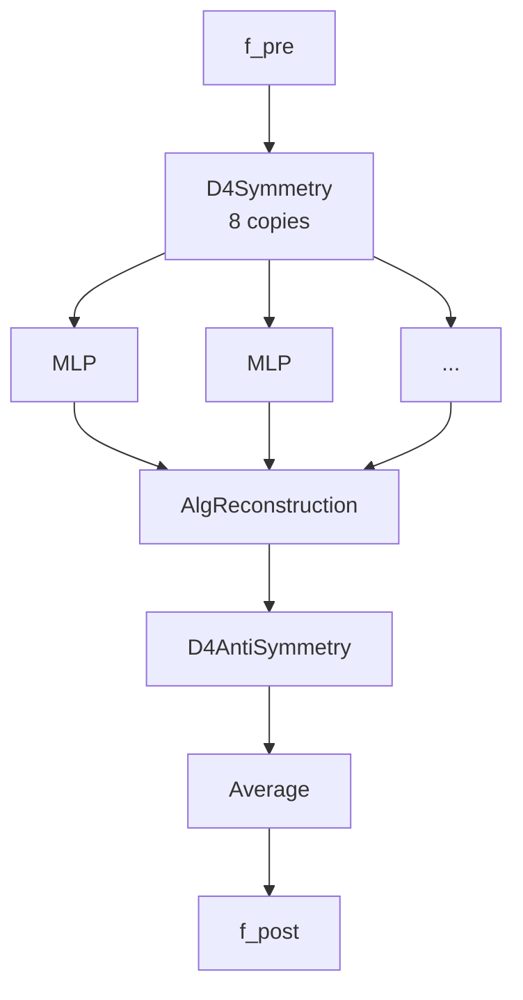

# Learning the Lattice Boltzmann <br/> Collision Operator

A Physics-Informed Machine Learning prototype

<div class="pt-8 opacity-70 text-sm">
ML4PhA · Block 05 · Group 11
</div>

<div class="abs-br m-6 text-xs opacity-50">
Based on Corbetta, Gabbana et al., <em>Eur. Phys. J. E</em> (2023) ·
<a href="https://arxiv.org/abs/2212.06124" target="_blank">arxiv:2212.06124</a>
</div>

---
layout: two-cols
---

# Why physics-informed ML for fluids?

- Direct CFD solvers are accurate but expensive — every collision/relaxation step
  costs the same regardless of flow complexity.
- Pure black-box networks fit data well **but break physics**: mass leaks,
  momentum drifts, simulations diverge.
- **Physics-Informed ML (PIML):** bake the structure of the problem
  (symmetries, conservation laws) *into the architecture* rather than
  hoping the loss function teaches it.

::right::

<div class="pl-6 pt-2">

### What we do here

Train a neural net to replace the **collision step** of a Lattice Boltzmann
simulation, while guaranteeing — by construction — that

- mass is conserved exactly,
- momentum is conserved exactly,
- the operator is equivariant under the D4 lattice symmetry.

The rest of the LBM pipeline (streaming) stays as-is.

</div>

---

# Lattice Boltzmann in one slide

Track **populations** $f_i(x,t)$ — particles at node $x$ moving in direction $i$.

<div class="grid grid-cols-2 gap-8 pt-4">

<div>

**D2Q9 stencil** — 2D, 9 velocities:

- 1 rest (`i=0`)
- 4 axis-aligned (E, N, W, S)
- 4 diagonal (NE, NW, SW, SE)

Macroscopic fields come from moments:

$$
\rho = \sum_i f_i, \quad \rho\mathbf{u} = \sum_i f_i\, \mathbf{c}_i
$$

</div>

<div>

**Two-step update each timestep:**

1. **Streaming** — populations hop along their velocity vector.
2. **Collision** — populations relax toward local equilibrium $f_i^{\text{eq}}(\rho, \mathbf{u})$.

Classic BGK collision (the part we replace):

$$
f_i^{\text{post}} = f_i^{\text{pre}} + \tfrac{1}{\tau}\left(f_i^{\text{eq}} - f_i^{\text{pre}}\right)
$$

</div>

</div>

<div class="pt-6 text-sm opacity-70">
Goal: learn the map <code>f_pre → f_post</code> as a neural network.
</div>

---

# The problem statement

<v-clicks>

- **Input:** 9 pre-collision populations $\mathbf{f}^{\text{pre}} \in \mathbb{R}^9$ at one lattice node.
- **Output:** 9 post-collision populations $\mathbf{f}^{\text{post}} \in \mathbb{R}^9$ at the same node.
- **Hard constraints** (must hold *exactly*, not approximately):

$$
\sum_i f_i^{\text{post}} = \sum_i f_i^{\text{pre}} \quad\text{(mass)}
$$

$$
\sum_i f_i^{\text{post}}\, c_{i,x} = \sum_i f_i^{\text{pre}}\, c_{i,x} \quad\text{(x-momentum)}
$$

$$
\sum_i f_i^{\text{post}}\, c_{i,y} = \sum_i f_i^{\text{pre}}\, c_{i,y} \quad\text{(y-momentum)}
$$

- **Symmetry:** the operator must commute with the 8 elements of D4
  (4 rotations + 4 reflections of the square lattice).

</v-clicks>

---
layout: two-cols
---

# Step 1 — Training data

`run-all-tensorflow.py` lines 37–245

Synthetic, BGK-generated triples $(\mathbf{f}^{\text{eq}}, \mathbf{f}^{\text{pre}}, \mathbf{f}^{\text{post}})$:

1. Draw random macroscopics
   $\rho \sim \mathcal{U}(0.95, 1.05)$,
   $|\mathbf{u}| \sim \mathcal{U}(0, 0.01)$, random angle.
2. Compute $\mathbf{f}^{\text{eq}}$ via the D2Q9 Maxwell–Boltzmann expansion.
3. Add a *projected* random non-equilibrium part $\mathbf{f}^{\text{neq}}$
   (mean-zero, zero net mass & momentum).
4. Apply BGK to get $\mathbf{f}^{\text{pre}}, \mathbf{f}^{\text{post}}$
   with $\tau = 1$.
5. **Reject** any sample with negative populations
   (unphysical → keeps training in the valid region).

::right::

<div class="pl-6 text-sm">

**Settings**

| Parameter | Value |
|---|---|
| `n_samples` | 100 000 |
| `u_abs_max` | 0.01 |
| `sigma_max` | 5 × 10⁻⁴ |
| `tau` | 1.0 |
| Train/test split | 70 / 30 |

Normalised by density so the network sees only the *shape* of the distribution:

```python
fpre  = fpre  / fpre.sum(axis=1, keepdims=True)
fpost = fpost / fpost.sum(axis=1, keepdims=True)
```

</div>

---

# Step 2 — Architecture: the equivariant lift

The square lattice has the dihedral group **D4** — 8 symmetry operations.
A correct collision operator must commute with all 8.

<div class="grid grid-cols-2 gap-6 pt-4">

<div>

**Group-equivariant lift / pool** pattern:

1. **Lift** (`D4Symmetry`): build all 8 rotated/reflected copies of the input.
2. **Process** each copy through the *same shared-weight* MLP.
3. **Project back** (`D4AntiSymmetry`): undo each transform on the corresponding output.
4. **Average** — result is invariant by construction.

</div>

<div>



</div>

</div>

<div class="text-xs opacity-60 pt-2">
Same MLP weights see every orientation → ~8× effective data, automatic equivariance.
</div>

---

# Step 2 — Architecture: enforcing conservation

`AlgReconstruction` makes conservation **algebraic**, not a soft penalty.

<div class="grid grid-cols-2 gap-6">

<div>

- 9 populations, 3 conservation constraints (mass + 2 momenta)
  → only **6 degrees of freedom** in the collision update.
- Let $\Delta f = \mathbf{f}^{\text{post}} - \mathbf{f}^{\text{pre}}$.
- The MLP predicts $\Delta f_i$ for indices $i \in \{0, 1, 3, 4, 6, 7\}$.
- The remaining three ($\Delta f_2, \Delta f_5, \Delta f_8$) are **solved**
  from the conservation equations:

</div>

<div>

```python
# from utils.AlgReconstruction
df2 = -(df0 + 2*df3 + df4 + 2*df6 + 2*df7)
df5 =  0.5*( df0 + 3*df3 + 2*df4
           + 2*df6 + 4*df7 - df1)
df8 = -0.5*( df0 + df1 + df3
           + 2*df4 + 2*df7)
f_post = f_pre + df  # exact conservation
```

</div>

</div>

<div class="pt-4 text-sm opacity-80">
<strong>Net effect:</strong> the network <em>cannot</em> violate mass or momentum
conservation, even at random initialisation or on out-of-distribution inputs.
</div>

---
layout: two-cols
---

# Step 3 — Training

The inner MLP is small:

- 2 hidden layers, 50 units each
- `relu` activations, no bias
- He-uniform init
- `softmax` on the last layer (output is a normalised distribution)

**Loss** — Root-Mean-Square *Relative* Error:

$$
\mathcal{L} = \sqrt{\frac{1}{Q}\sum_i \left(\frac{y_i - \hat{y}_i}{y_i + \varepsilon}\right)^2}
$$

so the network is penalised equally in low- and high-density regions.

::right::

<div class="pl-6 text-sm">

**Training loop** (`fit`):

| Setting | Value |
|---|---|
| Optimiser | Adam |
| Batch size | 32 |
| Epochs | 200 (max) |
| Early stopping | patience 50 |
| Precision | float64 |

EarlyStopping + ModelCheckpoint restore best weights.

</div>

<div class="pl-6 pt-4">


<div class="text-xs opacity-60">
Placeholder — drop in <code>artifacts-run-all-tensorflow/training_loss.png</code>.
</div>

</div>

---

# Step 4 — Plug it into LBM

The trained network replaces *only* the collision step. Streaming is unchanged.

```python {all|3-9|11-14|all}
for t in range(1, niter):
    # 1. Streaming — populations move along their velocity
    for ip in range(Q):
        f1[:, :, ip] = np.roll(np.roll(f2[:, :, ip],
                                       c[ip, 0], axis=0),
                                       c[ip, 1], axis=1)

    # 2. Density-normalise the input distribution
    fpre = f1.reshape(nx*ny, Q)
    norm = fpre.sum(axis=1, keepdims=True)
    fpre = fpre / norm

    # 3. NN collision — one forward pass per node
    f2 = model.predict(fpre, verbose=0)
    f2 = (norm * f2).reshape(nx, ny, Q)
```

<div class="pt-2 text-sm opacity-70">
The whole "physics" — streaming, normalisation, rescaling — stays explicit;
the network only handles the local relaxation it was trained for.
</div>

---

# Step 5 — Benchmark: Taylor–Green vortex

A canonical decaying-vortex test.

<div class="grid grid-cols-2 gap-6 pt-2 text-sm">

<div>

**Setup**

- 32 × 32 grid, periodic
- $u_0 = 0.01$, $\tau = 1.0$
- 1000 timesteps
- Initial condition:
  $u_x = u_0 \sin(x)\cos(y)$,
  $u_y = -u_0 \cos(x)\sin(y)$
- Analytic solution: exponential decay of $\langle |\mathbf{u}| \rangle$
  with viscosity $\nu = (\tau - 1/2)\, c_s^2$.

**What we check**

1. Mass conservation throughout the run.
2. Velocity decay vs analytic.
3. Vortex structure visually preserved.

</div>

<div>


<div class="text-xs opacity-60">
Placeholder — drop in <code>velocity_decay.png</code>.
NN-LBM points (blue) should overlay the analytic curve (red dashed).
</div>

</div>

</div>

---

# Vortex fields over time

<div class="grid grid-cols-3 gap-2 pt-4">

<div class="text-center">


<div class="text-xs opacity-60 pt-1">t = 0</div>
</div>

<div class="text-center">


<div class="text-xs opacity-60 pt-1">t = 500</div>
</div>

<div class="text-center">


<div class="text-xs opacity-60 pt-1">t = 900</div>
</div>

</div>

<div class="pt-4 text-sm opacity-80">
The four counter-rotating cells stay coherent and shrink in amplitude as
viscous dissipation takes over — same qualitative behaviour as standard BGK.
</div>

<div class="text-xs opacity-50 pt-4">
Placeholders — drop the corresponding <code>velocity_field_tXXXXX.png</code> frames into <code>assets/</code>.
</div>

---

# What the physics buys us

<v-clicks>

- **Sample efficiency** — D4 lift gives ~8× effective data with shared weights.
- **Stability** — exact mass/momentum conservation eliminates the long-time
  drift that plagues vanilla MLPs on this task.
- **Generalisation** — the operator is *trained at* $\tau = 1$ on random
  thermalised states, but works on a Taylor–Green vortex it has never seen.
- **Interpretability** — the network only models the 6 unconstrained DoFs;
  everything else is exact algebra.

</v-clicks>

<div v-click class="pt-6 text-sm opacity-80">
This is the PIML pattern in miniature: <em>identify the symmetries and invariants,
then constrain the architecture so they can't be violated</em> — rather than
hoping a large network plus a soft loss learns them from data.
</div>

---

# Limitations & next steps

<div class="grid grid-cols-2 gap-8 pt-2">

<div>

**Known limitations**

- Trained on a narrow window of $\rho, |\mathbf{u}|, \tau$ — extrapolation
  outside is uncharted.
- One-node operator: no spatial coupling beyond the standard streaming step.
- Per-node `model.predict()` is slower than a hand-tuned BGK kernel — the
  win is in *flexibility*, not raw speed.

</div>

<div>

**Where this goes next**

- Train across a range of $\tau$ (varying viscosity).
- Replace BGK data with **MRT** or **Lattice-Boltzmann-Boltzmann** collision
  data to learn more physical operators.
- Compare against a black-box MLP baseline to quantify the gain from
  D4 + conservation.
- Push to 3D / D3Q27 — same group-equivariance pattern, larger group.

</div>

</div>

---
layout: center
class: text-center
---

# Thank you

Slides: <code>https://ML4PhA-G11.github.io/presentation/</code>

Code: [`learning_lbm_collision_operator/run-all-tensorflow.py`](https://github.com/ML4PhA-G11)

<div class="pt-8 text-sm opacity-70">

Reference paper —
Corbetta, Gabbana, Gyrya, Livescu, Prins, Toschi.
*Toward learning Lattice Boltzmann collision operators.* EPJ-E **46**, 10 (2023).
[arxiv:2212.06124](https://arxiv.org/abs/2212.06124)

</div>

<div class="pt-12 text-xs opacity-50">
Built with <a href="https://sli.dev" target="_blank">Slidev</a> ·
Press <kbd>f</kbd> for fullscreen, <kbd>o</kbd> for overview
</div>
