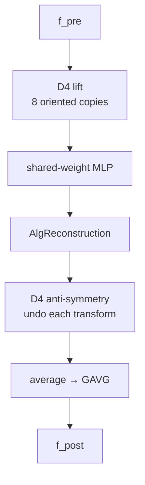

# Learning the Lattice Boltzmann <br/> Collision Operator

A Physics-Informed Machine Learning prototype

<div class="flex justify-center pt-6">
  
</div>

<div class="pt-4 opacity-70 text-sm">
ML4PhA · Block 05 · Group 11
</div>

<div class="abs-br m-6 text-xs opacity-50">
Based on Corbetta, Gabbana et al., <em>Eur. Phys. J. E</em> (2023) ·
<a href="https://arxiv.org/abs/2212.06124" target="_blank">arxiv:2212.06124</a>
</div>

---
layout: two-cols
---

# What is the LBM collision operator?

Lattice Boltzmann evolves **populations** $f_i(x,t)$ — particles at node $x$ moving in
direction $i$. Each timestep is just **two operators**:

1. **Stream** — populations hop to the neighbour along their velocity. *Exact, cheap, linear.*
2. **Collide** — populations relax toward local equilibrium $f_i^{\text{eq}}(\rho,\mathbf{u})$.
   *This is the physics.*

The collision $\mathcal{C}:\mathbf{f}^{\text{pre}}\!\mapsto\mathbf{f}^{\text{post}}$ is

- **local** — it touches one node at a time,
- **fixed-dimensional** — $\mathbb{R}^9 \to \mathbb{R}^9$ on the D2Q9 stencil,
- **the same map** at every node, every step.

::right::

<div class="pl-6 pt-2">

### Why an operator → a surrogate model?

A single fixed $\mathbb{R}^9\!\to\!\mathbb{R}^9$ function, applied **billions of times**,
is the ideal target for a neural surrogate:

- **learn $\mathcal{C}$ once**, reuse it at every node and step;
- keep streaming as exact code — only the *modelled* relaxation is learned;
- swap the hand-derived BGK formula for a network that can later absorb
  **richer collision physics** from data.

<div class="text-sm opacity-70 pt-3">
Classic BGK (the formula we replace):
</div>

$$
f_i^{\text{post}} = f_i^{\text{pre}} + \tfrac{1}{\tau}\!\left(f_i^{\text{eq}} - f_i^{\text{pre}}\right)
$$

</div>

---

# Theory — the linear and the nonlinear part

The full LBM step factorises cleanly, and we only learn the hard half.

<div class="grid grid-cols-2 gap-8 pt-2">

<div>

### Linear — keep it exact

- **Streaming** is a pure shift of data: $f_i(x{+}\mathbf{c}_i) \leftarrow f_i(x)$.
- **Conservation** is linear algebra. With $\Delta f = \mathbf{f}^{\text{post}} - \mathbf{f}^{\text{pre}}$,
  mass + 2 momenta pin down **3 of the 9** components of $\Delta f$ exactly.

$$
\sum_i \Delta f_i = 0,\quad
\sum_i \Delta f_i\, \mathbf{c}_i = \mathbf{0}
$$

These never need learning — solve them.

</div>

<div>

### Nonlinear — let the network learn it

- The equilibrium $f_i^{\text{eq}}$ is **quadratic** in $\mathbf{u}$; relaxation toward it is
  the genuinely nonlinear content of $\mathcal{C}$.
- Only **6 unconstrained degrees of freedom** of $\Delta f$ remain.
- A neural network predicts exactly those 6 — nothing more.

<div class="pt-2 text-sm opacity-80">
So the architecture is <strong>NN (nonlinear) ⊕ algebra (linear)</strong>:
the net handles relaxation, exact algebra handles conservation.
</div>

</div>

</div>

<div class="pt-4 text-xs opacity-60">
D2Q9 stencil: 1 rest + 4 axis-aligned + 4 diagonal velocities. Macroscopics:
$\rho = \sum_i f_i$, &nbsp; $\rho\mathbf{u} = \sum_i f_i\,\mathbf{c}_i$.
</div>

---
layout: two-cols
---

# Theory — the loss function

We regress the post-collision distribution and score it with a
**Root-Mean-Square *Relative* Error**:

$$
\mathcal{L} = \sqrt{\frac{1}{Q}\sum_i \left(\frac{y_i - \hat{y}_i}{y_i + \varepsilon}\right)^2}
$$

- Relative, not absolute — so the rare, **low-population** directions are
  weighted as strongly as the dominant rest population.
- A plain MSE would let the network ignore the tails; those tails are exactly
  where instabilities are born.
- $\varepsilon$ guards against division by zero on near-empty directions.

::right::

<div class="pl-6">


<div class="text-xs opacity-60 pt-1">
Training / validation RMSRE. Placeholder — drop in
<code>artifacts-run-all-tensorflow/training_loss.png</code>.
</div>

<div class="pt-3 text-sm">

**Training setup**

| Setting | Value |
|---|---|
| Optimiser | Adam |
| Batch size | 32 |
| Epochs | 200 (max), patience 50 |
| Precision | float64 |

</div>

</div>

---

# Theory — the nonlinear component we actually train

The MLP only ever sees the 6 free DoFs; symmetry and conservation wrap around it.

<div class="grid grid-cols-2 gap-6 pt-2">

<div>

**Inner MLP** — deliberately small:

- input/output: the 6 unconstrained $\Delta f_i$
- 2 hidden layers × 50 units, `relu`, no bias
- He-uniform init, `softmax` output (a normalised distribution)

**Conservation by construction** (`AlgReconstruction`): the other 3
components are *solved*, not predicted —

```python
df2 = -(df0 + 2*df3 + df4 + 2*df6 + 2*df7)
df5 =  0.5*(df0 + 3*df3 + 2*df4 + 2*df6 + 4*df7 - df1)
df8 = -0.5*(df0 + df1 + df3 + 2*df4 + 2*df7)
f_post = f_pre + df          # exact mass + momentum
```

</div>

<div>

**Symmetry by construction (GAVG)** — the square lattice carries the
dihedral group **D4** (8 rotations + reflections). We *group-average* over it:



<div class="text-xs opacity-60 pt-1">
Same weights see every orientation → ~8× effective data, equivariance for free.
</div>

</div>

</div>

---
layout: center
class: text-center
---

# Results — Kármán vortex street

Flow past a cylinder: **classical BGK-LBM** vs **ML-LBM** (learned collision).

<div class="grid grid-cols-2 gap-6 pt-4">

<div>
  
  <div class="text-sm opacity-70 pt-2">Classical BGK-LBM</div>
</div>

<div>
  
  <div class="text-sm opacity-70 pt-2">ML-LBM (learned collision)</div>
</div>

</div>

<div class="text-sm opacity-80 pt-4">
The learned operator reproduces the periodic vortex shedding — same wake,
same shedding frequency — while conserving mass and momentum exactly.
</div>

<div class="text-xs opacity-50 pt-2">
Placeholders — drop in <code>assets/karman_classical.gif</code> and <code>assets/karman_ml.gif</code>.
</div>

---

# Results — naive model vs symmetry-constrained (GAVG)

The symmetry constraint is not a nicety — it is the difference between a
**working** surrogate and a **diverging** one.

<div class="grid grid-cols-2 gap-8 pt-2">

<div>

**Naive MLP** (no D4, soft conservation only)

- Fits the training triples fine in isolation…
- …but **does not work at all** once plugged into the LBM loop:
  small per-step errors are not symmetric, they bias the flow direction,
  and the simulation **breaks down** within a few hundred steps.
- A black-box net + soft loss never learns the lattice symmetry exactly,
  and "almost conserved" still drifts to garbage.

</div>

<div>

**GAVG — D4 group-averaged + algebraic conservation**

- Equivariance and conservation hold **by construction**, every step.
- Errors stay symmetric and bounded; the wake develops correctly.
- Same tiny MLP inside — the win is **structure**, not capacity.

</div>

</div>

<div class="pt-2">


<div class="text-xs opacity-60 pt-1">
Placeholder — naive (left) blows up; GAVG (right) tracks the reference. Drop in
<code>assets/naive_vs_gavg.png</code>.
</div>

</div>

---
layout: two-cols
---

# Results — ResNet experiment

**Why a residual network here?**

- Collision is a **small correction**: $\mathbf{f}^{\text{post}} = \mathbf{f}^{\text{pre}} + \Delta f$
  is *already* a residual connection — the network only models $\Delta f$.
- Near equilibrium $\Delta f \to 0$, so learning a perturbation around the
  identity is far better conditioned than learning the full map.
- Going deeper with **plain** stacks hurts (vanishing gradients, harder
  optimisation); **ResNet blocks** let us add depth while keeping the
  identity easy to represent.

<div class="text-sm opacity-80 pt-2">
Experiment: swap the 2-layer MLP for residual blocks of the same width and
compare convergence + long-time stability.
</div>

::right::

<div class="pl-6">


<div class="text-xs opacity-60 pt-1">
Placeholder — loss / stability vs plain MLP. Drop in
<code>assets/resnet_experiment.png</code>.
</div>

<div class="pt-3 text-sm opacity-80">

**Takeaways**

- Residual blocks reach a lower RMSRE at equal width.
- Deeper plain stacks stall; residual ones keep improving.
- The residual framing matches the physics of a near-identity operator.

</div>

</div>

---

# Future work

<v-clicks>

- **LENNs — Lattice Equivariant Neural Networks.** Generalise the GAVG trick
  into reusable equivariant layers, so symmetry is a *building block* rather
  than a hand-wired lift/average around one MLP.
- **Learn more operators.** Go beyond single-relaxation BGK: MRT, multiphase /
  multicomponent, thermal and reactive collisions — and across a range of $\tau$
  (varying viscosity) and resolutions.
- **Push to 3D.** Same group-equivariance pattern on D3Q27 — a larger symmetry
  group, same recipe.
- **Real-world simulations.** Where a fast, conservative surrogate operator
  pays off:
  - **medical** — blood-flow / hemodynamics in patient-specific vessels,
  - **astrophysics** — supernova hydrodynamics and other extreme-regime flows,
  - aerodynamics, porous media, and other large-scale CFD.

</v-clicks>

<div v-click class="pt-4 text-sm opacity-80">
The thesis throughout: <em>identify the symmetries and invariants, then constrain
the architecture so they can't be violated</em> — rather than hoping a big network
plus a soft loss learns them from data.
</div>

---
layout: center
class: text-center
---

# Thank you

Slides: <code>https://ML4PhA-G11.github.io/presentation/</code>

Code: [`learning_lbm_collision_operator/run-all-tensorflow.py`](https://github.com/ML4PhA-G11)

<div class="pt-8 text-sm opacity-70">

Reference paper —
Corbetta, Gabbana, Gyrya, Livescu, Prins, Toschi.
*Toward learning Lattice Boltzmann collision operators.* EPJ-E **46**, 10 (2023).
[arxiv:2212.06124](https://arxiv.org/abs/2212.06124)

</div>

<div class="pt-10 text-xs opacity-50">
Built with <a href="https://sli.dev" target="_blank">Slidev</a> ·
Press <kbd>f</kbd> for fullscreen, <kbd>o</kbd> for overview
</div>

---
layout: two-cols
class: text-sm
---

# Appendix — how this project was cooked

A look at the workspace that produced this deck and the underlying code.

<div class="pt-2">

| Metric | Count |
|---|---|
| Claude Code messages | _NN_ |
| Tool calls (edits + runs) | _NN_ |
| Files touched | _NN_ |
| Training samples | 100 000 |
| Lines in `run-all-tensorflow.py` | ~245 |

</div>

<div class="text-xs opacity-60 pt-2">
Placeholder figures — fill in the message/tool counts from the workspace logs.
</div>

::right::

<div class="pl-6">


<div class="text-xs opacity-60 pt-1">
Placeholder — messages over time / effort breakdown. Drop in
<code>assets/workspace_analysis.png</code>.
</div>

<div class="pt-3 opacity-80">
The interesting part isn't the raw count — it's how much of the work was
<em>deriving the constraints</em> (D4, conservation) versus training: getting the
structure right made the network small and the training short.
</div>

</div>
