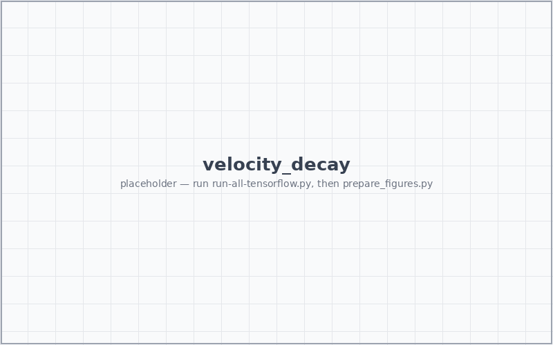

<!-- .slide: class="tc title" -->

# Learning the Lattice Boltzmann<br>Collision Operator

### A Physics-Informed Machine Learning prototype


<p class="subtitle">ML4PhA · Group 11</p>

---

## Fluid dynamics simulation is hard

<div class="cols">
<div>

### The challenge

- **Nonlinear** — Navier–Stokes advection
- **Chaotic** — tiny perturbations → large divergence
- **Expensive** — fine grids, long runs

</div>
<div>

### Lattice Boltzmann answers each

- nonlinearity → local equilibrium $f_i^{\text{eq}}$ per node
- chaos → finer grid, paid back by **parallelism**
- cost → node-local, **naturally parallel**

</div>
</div>

<div class="box" style="text-align:center;">

Each step = **stream** (linear, exact) + **collide** (nonlinear, local). Only collision is hard.

</div>

---

## Learn the nonlinear part

The nonlinearity lives in the **collision** — products of populations, like Boltzmann's binary collision integral.

<div class="cols">
<div>

$$ \Omega(f) \sim \int (f'f_1' - f f_1)\, d\Omega $$

In LBM it relaxes toward a **quadratic** equilibrium:

$$ f_i^{\text{post}} = f_i^{\text{pre}} + \tfrac{1}{\tau}\!\left(f_i^{\text{eq}}-f_i^{\text{pre}}\right) $$

We learn this map $\mathbb{R}^9\!\to\!\mathbb{R}^9$, keep streaming exact. Conservation pins **3 of 9** components → the net predicts only **6 DoFs**; D4 symmetry is enforced **by construction (GAVG)**.

</div>
<div>

RMS *relative* error <span class="muted">(Corbetta 2023)</span>:

$$ \mathcal{L} = \sqrt{\frac{1}{Q}\sum_i\!\left(\frac{y_i-\hat{y}_i}{y_i+\varepsilon}\right)^{\!2}} $$

Relative → weights the rare **low-population** directions, where instabilities are born.


<!-- .element: style="width:100%; border-radius:6px;" -->

</div>
</div>

---

## Taylor–Green vortex — the benchmark

<div class="cols">
<div>

A decaying array of counter-rotating vortices with a **closed-form** analytic solution — exact ground truth.

- periodic box, no walls
- velocity decays as $e^{-2\nu k^2 t}$
- every model must match this curve

</div>
<div>

<div style="display:flex; gap:6px;">


</div>
<p class="cap" style="text-align:center;">TGV vorticity at t = 0, 500, 900.</p>

</div>
</div>

---

## Taylor–Green — naive vs GAVG

<div class="cols">
<div>

### Naive MLP <span class="muted">(no D4, soft conservation)</span>

- fits training triples fine in isolation…
- …but **diverges** in the LBM loop within a few hundred steps.

### GAVG <span class="muted">(D4 + algebraic conservation)</span>

- symmetry & conservation hold **every step**
- errors stay bounded → decay curve tracked

</div>
<div>


<!-- .element: style="width:100%; border-radius:6px;" -->

<p class="cap" style="text-align:center;">Velocity decay vs analytic — GAVG follows, naive blows up.</p>

</div>
</div>

---

<!-- .slide: class="tc" -->

## Kármán vortex street

Flow past a cylinder, **Re 150** — classical BGK-LBM vs learned ML-LBM.

<div class="cols" style="margin-top:10px;">
<div>

<p class="cap" style="text-align:center;">Classical BGK-LBM</p>
</div>
<div>

<p class="cap" style="text-align:center;">ML-LBM (learned collision)</p>
</div>
</div>

<div class="box" style="text-align:center; margin-top:8px;">

Same wake, same shedding frequency — mass & momentum conserved <span class="highlight">exactly</span>.

</div>

---

## Beyond GAVG — ResNet

<div class="cols">
<div>

Collision is **already a residual**: $f^{\text{post}} = f^{\text{pre}} + \Delta f$, and $\Delta f \to 0$ near equilibrium.

Same D4 + conservation wrapper; only the inner net becomes residual blocks:

```python
x = Dense(n, "relu")(x)
x = Dense(n, activation=None)(x)  # may be negative
x = Add()([x, residual])          # corrects either way
```

</div>
<div>


<!-- .element: style="width:100%; border-radius:6px;" -->

- lower RMSRE at equal width
- deeper plain stacks stall; residual ones keep improving
- residual framing matches a near-identity operator

</div>
</div>

---

## Future work

- **LENNs — Lattice Equivariant NNs.** Symmetry as a reusable building block, not a hand-wired lift/average around one MLP.
- **More operators.** Beyond BGK: MRT, multiphase, thermal — across varying $\tau$ and resolution.
- **Push to 3D.** Same group-equivariance recipe on D3Q27.
- **Real-world flows.** Hemodynamics, supernova hydrodynamics, aerodynamics; domain boundaries via surrogate models.

---

## Future work — more

- **Deeper naive models.** Does raw capacity alone ever stabilise the loop — or is structure (D4 + conservation) irreplaceable?

<div class="box">

The thesis: *find the symmetries and invariants, then constrain the architecture so they can't be violated* — rather than hoping a big network plus a soft loss learns them.

</div>

---

## Appendix — Corbetta, Gabbana et al. (2023)

*Toward learning Lattice Boltzmann collision operators.* EPJ-E **46**, 10 (2023).

- introduces the learned-collision framing and the RMS-relative-error loss we adopt
- D2Q9 lattice, BGK baseline, symmetry-aware networks

<a href="https://arxiv.org/abs/2212.06124" target="_blank">arxiv:2212.06124</a>

---

## Appendix — how this project was cooked

<div class="cols">
<div>

| Metric | Count |
|---|---|
| Claude Code messages | *NN* |
| Tool calls (edits + runs) | *NN* |
| Files touched | *NN* |
| Training samples | 100&thinsp;000 |

<p class="cap">Placeholder counts — fill in from workspace logs.</p>

</div>
<div>


<!-- .element: style="width:100%; border-radius:6px;" -->

<div class="box">

Most effort went into **deriving the constraints** (D4, conservation) — getting the structure right kept the network small and training short.

</div>

</div>
</div>

---

## Appendix — how we used GenAI

<div class="cols">
<div>

<div class="box">

<span class="muted" style="color:#3498db; font-weight:600;">1 · Draft manually</span>

We own the **architecture and spec** — D4 symmetry, conservation algebra, train/sim split. AI fills in against *our* design.

</div>

<div class="box">

<span class="muted" style="color:#3498db; font-weight:600;">2 · Gate & verify</span>

Every line **read and checked**: conservation to machine precision, limits right, results match baseline.

</div>

</div>
<div>

<div class="box">

<span class="muted" style="color:#3498db; font-weight:600;">3 · Always reproducible</span>

Output accepted only as **scripts** — fixed seeds, pinned configs, one command per figure.

</div>

<div class="box" style="background:#eef5fb; border:1px solid #d6e6f5;">

**Principle:** GenAI is a fast junior collaborator — <span class="highlight">accountable to us</span>. We own design, verification, reproducibility.

</div>

</div>
</div>
