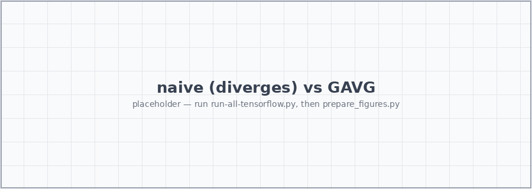

<!-- .slide: class="tc title" -->

# Learning the Lattice Boltzmann<br>Collision Operator

### A Physics-Informed Machine Learning prototype


<p class="subtitle">ML4PhA · Block 05 · Group 11</p>
<p class="subtitle" style="font-size:0.5em;">Based on Corbetta, Gabbana et al., <em>Eur. Phys. J. E</em> (2023) · <a href="https://arxiv.org/abs/2212.06124" target="_blank">arxiv:2212.06124</a></p>

---

## What is the LBM collision operator?

<div class="cols">
<div>

Lattice Boltzmann evolves **populations** $f_i(x,t)$ — particles at node $x$ moving in direction $i$. Each timestep is just **two operators**:

1. **Stream** — populations hop to the neighbour along their velocity. <span class="muted">*Exact, cheap, linear.*</span>
2. **Collide** — populations relax toward local equilibrium $f_i^{\text{eq}}(\rho,\mathbf{u})$. <span class="highlight">This is the physics.</span>

The collision $\mathcal{C}:\mathbf{f}^{\text{pre}}\!\mapsto\mathbf{f}^{\text{post}}$ is

- **local** — it touches one node at a time,
- **fixed-dimensional** — $\mathbb{R}^9 \to \mathbb{R}^9$ on D2Q9,
- **the same map** at every node, every step.

</div>
<div>

### Why an operator → a surrogate model?

A single fixed $\mathbb{R}^9\!\to\!\mathbb{R}^9$ function, applied <span class="highlight">billions of times</span>, is the ideal target for a neural surrogate:

- **learn $\mathcal{C}$ once**, reuse it at every node and step;
- keep streaming as exact code — only the *modelled* relaxation is learned;
- swap the hand-derived BGK formula for a network that can later absorb **richer collision physics** from data.

<div class="box">

<span class="muted">Classic BGK (the formula we replace):</span>

$$ f_i^{\text{post}} = f_i^{\text{pre}} + \tfrac{1}{\tau}\!\left(f_i^{\text{eq}} - f_i^{\text{pre}}\right) $$

</div>

</div>
</div>

---

## Theory — the linear and the nonlinear part

The full LBM step factorises cleanly, and we only learn the hard half.

<div class="cols">
<div>

### Linear — keep it exact

- **Streaming** is a pure shift of data: $f_i(x{+}\mathbf{c}_i) \leftarrow f_i(x)$.
- **Conservation** is linear algebra. With $\Delta f = \mathbf{f}^{\text{post}} - \mathbf{f}^{\text{pre}}$, mass + 2 momenta pin down **3 of the 9** components exactly.

<div class="box">

$$ \sum_i \Delta f_i = 0, \qquad \sum_i \Delta f_i\, \mathbf{c}_i = \mathbf{0} $$

</div>

<span class="muted">These never need learning — solve them.</span>

</div>
<div>

### Nonlinear — let the network learn it

- The equilibrium $f_i^{\text{eq}}$ is **quadratic** in $\mathbf{u}$; relaxation toward it is the genuinely nonlinear content of $\mathcal{C}$.
- Only <span class="highlight">6 unconstrained degrees of freedom</span> of $\Delta f$ remain.
- A neural network predicts exactly those 6 — nothing more.

<div class="box">

So the architecture is **NN (nonlinear) ⊕ algebra (linear)**: the net handles relaxation, exact algebra handles conservation.

</div>

</div>
</div>

<p class="cap">D2Q9 stencil: 1 rest + 4 axis-aligned + 4 diagonal velocities. Macroscopics: $\rho = \sum_i f_i$, &nbsp; $\rho\mathbf{u} = \sum_i f_i\,\mathbf{c}_i$.</p>

---

## Theory — the loss function

<div class="cols">
<div>

We regress the post-collision distribution and score it with a **Root-Mean-Square *Relative* Error**:

<div class="box">

$$ \mathcal{L} = \sqrt{\frac{1}{Q}\sum_i \left(\frac{y_i - \hat{y}_i}{y_i + \varepsilon}\right)^2} $$

</div>

- Relative, not absolute — so the rare, **low-population** directions are weighted as strongly as the dominant rest population.
- A plain MSE would let the network ignore the tails; those tails are exactly where <span class="highlight">instabilities</span> are born.
- $\varepsilon$ guards against division by zero on near-empty directions.

| Setting | Value |
|---|---|
| Optimiser | Adam, lr 1e-3 |
| Batch size | 32 |
| Epochs | 200 (max), patience 50 |
| Schedule | ReduceLROnPlateau (×0.5) |
| Split / precision | 70/30, float64 |

</div>
<div>


<!-- .element: style="width:100%; border-radius:6px;" -->

<p class="cap">Training / validation RMSRE. Placeholder — drop in <code>training_loss.png</code>.</p>

</div>
</div>

---

## Theory — the nonlinear component we train

The MLP only ever sees the 6 free DoFs; symmetry and conservation wrap around it.

<div class="cols">
<div>

**Inner MLP** — deliberately small (`lbm_ml/model/network.py`):

- $9 \to 9$, but `AlgReconstruction` overwrites 3 outputs — only <span class="highlight">6 DoFs</span> are effectively free
- 2 hidden layers × 50 units, `relu`, no bias, He-uniform init
- `softmax` last layer (output is a normalised distribution)
- shared inner net is swappable: `d4equivariant` (plain) or `resnet` (residual)

**Conservation by construction** (`AlgReconstruction`) — the other 3 components are *solved*, not predicted:

```python
df2 = -(df0 + 2*df3 + df4 + 2*df6 + 2*df7)
df5 =  0.5*(df0 + 3*df3 + 2*df4 + 2*df6 + 4*df7 - df1)
df8 = -0.5*(df0 + df1 + df3 + 2*df4 + 2*df7)
f_post = f_pre + df          # exact mass + momentum
```

</div>
<div>

**Symmetry by construction (GAVG)** — the square lattice carries the dihedral group <span class="highlight">D4</span> (8 rotations + reflections). We *group-average* over it:

<div class="flow">
  <div class="node">f_pre</div>
  <div class="arrow">↓</div>
  <div class="node">D4 lift — 8 oriented copies</div>
  <div class="arrow">↓</div>
  <div class="node">shared-weight MLP</div>
  <div class="arrow">↓</div>
  <div class="node">AlgReconstruction (conservation)</div>
  <div class="arrow">↓</div>
  <div class="node">D4 anti-symmetry — undo each transform</div>
  <div class="arrow">↓</div>
  <div class="node">average → <strong>GAVG</strong></div>
  <div class="arrow">↓</div>
  <div class="node">f_post</div>
</div>

<p class="cap">Same weights see every orientation → ~8× effective data, equivariance for free.</p>

</div>
</div>

---

<!-- .slide: class="tc" -->

## Results — Kármán vortex street

Flow past a cylinder (`lbm_karman-ng.py`): channel 2.2×0.41&nbsp;m, cylinder ∅&nbsp;0.10&nbsp;m, **Re&nbsp;150**, Zou–He in/outlet — **classical BGK-LBM** vs **ML-LBM**.

<div class="cols" style="margin-top:10px;">
<div>


<p class="cap" style="text-align:center;">Classical BGK-LBM</p>

</div>
<div>


<p class="cap" style="text-align:center;">ML-LBM (learned collision)</p>

</div>
</div>

<div class="box" style="text-align:center; margin-top:12px;">

The learned operator reproduces the periodic vortex shedding — same wake, same shedding frequency — while conserving mass and momentum <span class="highlight">exactly</span>.

</div>

---

## Results — naive vs symmetry-constrained (GAVG)

The symmetry constraint is not a nicety — it is the difference between a **working** surrogate and a **diverging** one.

<div class="cols">
<div>

### Naive MLP <span class="muted">(no D4, soft conservation)</span>

- Fits the training triples fine in isolation…
- …but <span class="highlight">does not work at all</span> in the LBM loop: small per-step errors aren't symmetric, they bias the flow direction, and the simulation <span class="highlight">breaks down</span> within a few hundred steps.
- A black-box net + soft loss never learns the lattice symmetry exactly, and "almost conserved" still drifts to garbage.

</div>
<div>

### GAVG <span class="muted">(D4 + algebraic conservation)</span>

- Equivariance and conservation hold **by construction**, every step.
- Errors stay symmetric and bounded; the wake develops correctly.
- Same tiny MLP inside — the win is **structure**, not capacity.

</div>
</div>

<div style="text-align:center; margin-top:6px;">


<p class="cap" style="text-align:center;">Placeholder — naive (left) blows up; GAVG (right) tracks the reference. Drop in <code>naive_vs_gavg.png</code>.</p>

</div>

---

## Results — ResNet experiment

<div class="cols">
<div>

**Why a residual inner net?** (the `resnet` model)

- Collision is a **small correction**: $\mathbf{f}^{\text{post}} = \mathbf{f}^{\text{pre}} + \Delta f$ is *already* a residual — the network only models $\Delta f \to 0$ near equilibrium.
- Same **D4 + AlgReconstruction wrapper**; only the shared inner sub-network changes from a plain stack to residual blocks.

Each block is a **two-layer bottleneck** with the skip added *after a linear (no-activation) projection*:

```python
x = Dense(n, "relu")(x)          # W1
x = Dense(n, activation=None)(x) # W2 — can be negative
x = Add()([x, residual])         # skip corrects either way
```

<p class="cap">A single <code>relu</code> block would force <code>relu(Wx) ≥ 0</code>, so the hidden state could only grow — the no-activation W₂ is what lets the skip correct in <em>either</em> direction.</p>

</div>
<div>


<!-- .element: style="width:100%; border-radius:6px;" -->

<p class="cap">Placeholder — loss / stability vs plain MLP. Drop in <code>resnet_experiment.png</code>.</p>

- Residual blocks reach a lower RMSRE at equal width.
- Deeper plain stacks stall; residual ones keep improving.
- The residual framing matches a near-identity operator.

</div>
</div>

---

## Future work

- **LENNs — Lattice Equivariant Neural Networks.** Generalise the GAVG trick into reusable equivariant layers, so symmetry is a *building block* rather than a hand-wired lift/average around one MLP.
- **Learn more operators.** Go beyond single-relaxation BGK: MRT, multiphase / multicomponent, thermal and reactive collisions — and across a range of $\tau$ (varying viscosity) and resolutions.
- **Push to 3D.** Same group-equivariance pattern on D3Q27 — a larger symmetry group, same recipe.
- **Real-world simulations**, where a fast, conservative surrogate operator pays off: **medical** (blood-flow / hemodynamics in patient-specific vessels), **astrophysics** (supernova hydrodynamics and other extreme-regime flows), aerodynamics, porous media, and other large-scale CFD.

<div class="box">

The thesis throughout: *identify the symmetries and invariants, then constrain the architecture so they can't be violated* — rather than hoping a big network plus a soft loss learns them from data.

</div>

---

<!-- .slide: class="tc thanks" -->

# Thank you

Slides: `https://ML4PhA-G11.github.io/presentation/talk.html`

Code: <a href="https://github.com/ML4PhA-G11/model-experiments" target="_blank"><code>ML4PhA-G11/model-experiments</code></a>

<p class="subtitle" style="margin-top:24px;">Reference paper — Corbetta, Gabbana, Gyrya, Livescu, Prins, Toschi. <em>Toward learning Lattice Boltzmann collision operators.</em> EPJ-E <strong>46</strong>, 10 (2023). <a href="https://arxiv.org/abs/2212.06124" target="_blank">arxiv:2212.06124</a></p>

---

## Appendix — how this project was cooked

A look at the workspace that produced this deck and the underlying code.

<div class="cols">
<div>

| Metric | Count |
|---|---|
| Claude Code messages | *NN* |
| Tool calls (edits + runs) | *NN* |
| Files touched | *NN* |
| Training samples | 100&thinsp;000 |
| Lines in `run_all.py` | ~370 |

<p class="cap">Placeholder figures — fill in the message/tool counts from the workspace logs.</p>

</div>
<div>


<!-- .element: style="width:100%; border-radius:6px;" -->

<p class="cap">Placeholder — messages over time / effort breakdown.</p>

<div class="box">

The interesting part isn't the raw count — it's how much of the work was *deriving the constraints* (D4, conservation) versus training: getting the structure right made the network small and the training short.

</div>

</div>
</div>

---

## Appendix — how we used GenAI

The physics and the structure are ours; the AI accelerates the typing — never the thinking, and never unchecked.

<div class="cols">
<div>

<div class="box">

<span class="muted" style="color:#3498db; font-weight:600;">1 · Draft manually</span>

We write the **software architecture** and **specification** ourselves — the D4 symmetry, the conservation algebra, the train/sim split. The AI fills in implementation against *our* design, it does not invent the design.

</div>

<div class="box">

<span class="muted" style="color:#3498db; font-weight:600;">2 · Gate & verify the code</span>

Every generated line is **read line by line** and gated like any scientific code — *software QA for physics & ML*: check conservation holds to machine precision, equilibria and limits are right, and results match a known baseline before they are trusted.

</div>

</div>
<div>

<div class="box">

<span class="muted" style="color:#3498db; font-weight:600;">3 · Always reproducible</span>

We only accept output as **reproducible scripts** — fixed seeds, pinned configs, one command to regenerate every figure in this deck. No notebook-only, copy-paste, or "trust me" results.

</div>

<div class="box" style="background:#eef5fb; border:1px solid #d6e6f5;">

**The principle:** GenAI is a fast junior collaborator — useful, but <span class="highlight">accountable to us</span>. We own the design, the verification, and the reproducibility; the tool owns none of them.

</div>

</div>
</div>

<p class="cap">In line with the ML4PhA GenAI policy: tier-based, transparent, and accountable AI usage.</p>
