<!-- .slide: class="tc title" -->

# Learning Nonlinear Physics

### Physics-Informed Machine Learning of Lattice Boltzmann Collision Operator

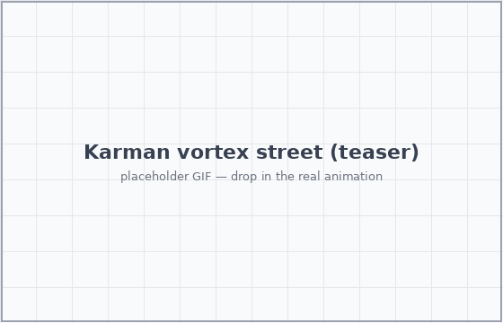

<p class="subtitle">ML4PhA · Group 11</p>

---

## Fluid dynamics simulation is hard

<div class="cols">
<div>

### The challenge

- **Nonlinear** — Navier–Stokes advection
- **Chaotic** — tiny perturbations → large divergence ("butterfly effect")
- **Expensive** — fine grids, long runs

</div>
<div>

### Lattice Boltzmann answers each

- nonlinearity → local equilibrium $f_i^{\text{eq}}$ per node
- chaos → finer grid, paid back by **parallelism**
- cost → node-local, **naturally parallel**

</div>
</div>

<div class="box" style="text-align:center;">
Macroscopic nonlinear: $(\mathbf{u} \cdot \nabla)\mathbf{u}$ vs.<br>
mesoscopic: the product of $f_i$ (the collision operator)
</div>

<div class="box" style="text-align:center;">
Each step = <strong>stream</strong> (linear, exact) + <strong>collide</strong> (nonlinear, local). Only collision is hard.
</div>

---

## Learn the nonlinear part

The nonlinearity lives in the **collision** — products of populations, like Boltzmann's binary collision integral.

<div class="cols">
<div>

$$ \Omega(f) \sim \int (f'f_1' - f f_1)\, d\Omega $$

In LBM it relaxes toward a **quadratic** equilibrium:

$$ f_i^{\text{post}} = f_i^{\text{pre}} - \tfrac{1}{\tau}\left(f_i^{\text{eq}}-f_i^{\text{pre}}\right) $$

</div>
</div>

---

## Learn the nonlinear part via NN architecture GAVG
<div class="cols">
<div>


We learn this map $\mathbb{R}^9\!\to\!\mathbb{R}^9$, keep streaming exact. Conservation pins **3 of 9** components → the net predicts only **6 DoFs**; D4 symmetry is enforced **by construction (GAVG)**.

</div>
<div>

MSRE <span class="muted">(Corbetta 2023)</span>:

$$ \mathrm{MSRE} = \sum_{i=0}^{8}\left(\frac{f_i^{\text{post}}-\hat{f}_i^{\text{post}}}{f_i^{\text{post}}}\right)^{2} $$

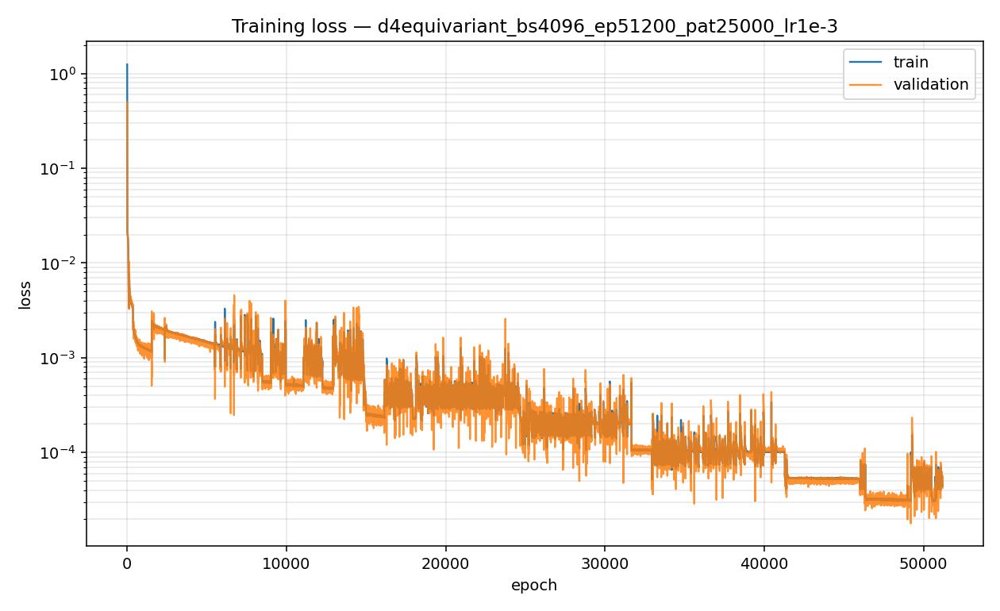
<!-- .element: style="width:100%; border-radius:6px;" -->

</div>
</div>

---

## Taylor–Green Vortex as a Stability Benchmark

<div class="cols">

<div>

### Why Taylor–Green?

- Periodic array of decaying vortices
- Analytical solution --> long-time recursive stability test
- Tiny ML errors accumulate over many timesteps

<br>

### Analytical decay

$$
u(t) \sim e^{-2 \nu k^2 t}
$$

<br>

</div>

<div>

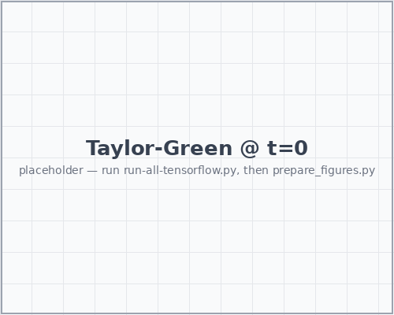
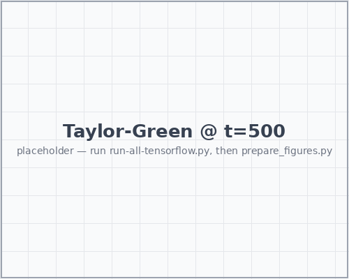
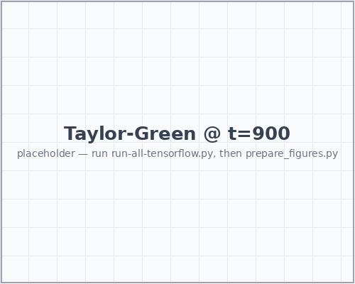

<p class="cap">
Taylor–Green vortex evolution at increasing timesteps
</p>

<br>

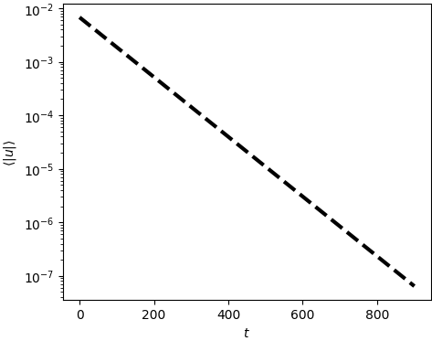

<p class="cap">
Analytical velocity decay
</p>

</div>

</div>

---

## What Happens if We Train a Neural Network?

<div class="cols">

<div class="fragment fade-in">

### Naive MLP

- No physical structure enforced
- Errors accumulate during rollout

<br>

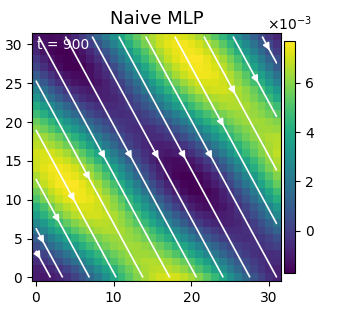

<p class="cap" style="font-size:0.75em;">
Vortex structure breaks down during long-time evolution
</p>

</div>

<div class="fragment fade-in">

### Lattice Symmetry

- Collision operator should respect D4 lattice symmetry
- Outputs are averaged over symmetry transforms

<br>

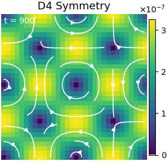

<p class="cap" style="font-size:0.75em;">
Symmetry averaging restores coherent vortex structure
</p>

</div>

<div class="fragment fade-in">

### Conservation

$$
\sum_i f_i = \rho
$$

$$
\sum_i f_i c_i = \rho u
$$

<br>

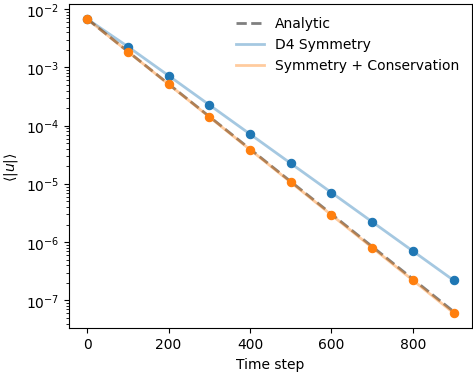

<p class="cap" style="font-size:0.75em;">
Reduced long-time drift in velocity decay
</p>

</div>

</div>

---

## Combining All Constraints

<div class="cols">

<div style="width:60%;">


<p class="cap">
Velocity decay comparison for all model variants
</p>

</div>

<div style="width:40%;">


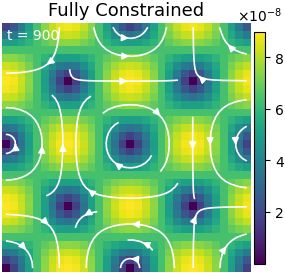

<p class="cap">
Naive → Symmetry → Fully constrained
</p>

<br>

</div>

</div>

---

<!-- .slide: class="tc" -->

## Kármán vortex street

Flow past a cylinder, **Re 150** — classical BGK-LBM vs learned ML-LBM.

<div class="cols" style="margin-top:10px;">
<div>
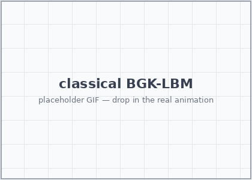
<p class="cap" style="text-align:center;">Classical BGK-LBM</p>
</div>
<div>
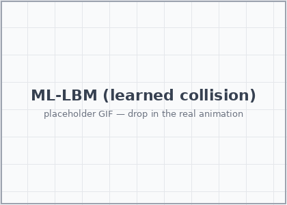
<p class="cap" style="text-align:center;">ML-LBM (learned collision)</p>
</div>
</div>

<div class="box" style="text-align:center; margin-top:8px;">

Same wake, same shedding frequency was expected —> mass & momentum conserved <span class="highlight">exactly</span> in both.
Yet the symmetry is not broken in the ML scenario. Suppressing the symmetry break? Fail to catch chaotic butterfly effect?

</div>

---

## Beyond GAVG — ResNet

<div class="cols">
<div>

Collision is **already a residual**: $f^{\text{post}} = f^{\text{pre}} + \Delta f$, and $\Delta f \to 0$ near equilibrium.

Same D4 + conservation wrapper; only the inner net becomes residual blocks:

```python
x = Dense(n, "relu")(x)
x = Dense(n, activation=None)(x)  # may be negative
x = Add()([x, residual])          # corrects either way
```

</div>
<div>

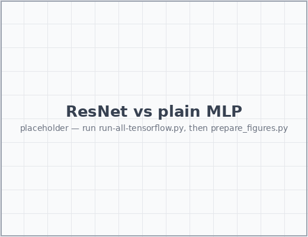
<!-- .element: style="width:100%; border-radius:6px;" -->

- lower RMSRE at equal width
- deeper plain stacks stall; residual ones keep improving
- residual framing matches a near-identity operator

</div>
</div>


---

## We caught the butterfly!


Flow past a cylinder, **Re 150** — classical BGK-LBM vs learned ML-LBM.

<div class="cols" style="margin-top:10px;">
<div>

<p class="cap" style="text-align:center;">Classical BGK-LBM</p>
</div>
<div>

<p class="cap" style="text-align:center;">ML-LBM (learned collision)</p>
</div>
</div>

<div class="box" style="text-align:center; margin-top:8px;">

Same wake, same shedding frequency was expected —> mass & momentum conserved <span class="highlight">exactly</span> in both.
Yet the symmetry is not broken in the ML scenario. Suppressing the symmetry break? Fail to catch chaotic butterfly effect?

</div>


---

## Future work

- **LENNs — Lattice Equivariant NNs.** Symmetry as a reusable building block, not a hand-wired lift/average around one MLP.
- **Push to 3D.** Same group-equivariance recipe on D3Q27.
- **Real-world flows.** Hemodynamics, supernova hydrodynamics, aerodynamics; domain boundaries via surrogate models.
- **Measure of Supression**. How much is the ML model supressing the anti-symmetry? Affects generalization.
- **Sensitivity to initial conditions**. Are the ML model results easily reproducible and general?

---

## Future work — more operators

Beyond single-relaxation BGK: MRT, multiphase, thermal — across varying $\tau$ and resolution.

| Operators | Surrogate model | Taylor–Green | Lid-Driven | Kármán Vortex Street |
| :--- | :--- | :---: | :---: | :---: |
| **BGK** | GAVG | ✓ | N/A | ✓ |
| | ResNet | ✓ | N/A | ✓ |
| | LENN | N/A | N/A | N/A |
| **MRT** | NCO | N/A | N/A | N/A |

<p class="cap">✓ = validated · N/A = not yet attempted.</p>

---

## Future work — more

- **Deeper naive models.** Does raw capacity alone ever stabilise the loop — or is structure (D4 + conservation) irreplaceable?

<div class="box">

The thesis: *find the symmetries and invariants, then constrain the architecture so they can't be violated* — rather than hoping a big network plus a soft loss learns them.

</div>

---

## Appendix — Corbetta, Gabbana et al. (2023)

*Toward learning Lattice Boltzmann collision operators.* EPJ-E **46**, 10 (2023).

- introduces the learned-collision framing and the RMS-relative-error loss we adopt
- D2Q9 lattice, BGK baseline, symmetry-aware networks

<a href="https://arxiv.org/abs/2212.06124" target="_blank">arxiv:2212.06124</a>

---

## Appendix — how this project was cooked

<div class="cols">
<div>

| Metric | Count |
|---|---|
| Claude Code messages | *NN* |
| Tool calls (edits + runs) | *NN* |
| Files touched | *NN* |
| Training samples | 100&thinsp;000 |

<p class="cap">Placeholder counts — fill in from workspace logs.</p>

</div>
<div>

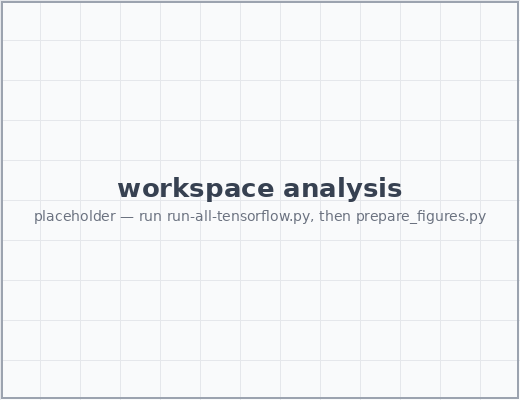
<!-- .element: style="width:100%; border-radius:6px;" -->

<div class="box">

Most effort went into **deriving the constraints** (D4, conservation) — getting the structure right kept the network small and training short.

</div>

</div>
</div>

---

## Appendix — how we used GenAI

<div class="cols">
<div>

<div class="box">

<span class="muted" style="color:#3498db; font-weight:600;">1 · Draft manually</span>

We own the **architecture and spec** — D4 symmetry, conservation algebra, train/sim split. AI fills in against *our* design.

</div>

<div class="box">

<span class="muted" style="color:#3498db; font-weight:600;">2 · Gate & verify</span>

Every line **read and checked**: conservation to machine precision, limits right, results match baseline.

</div>

</div>
<div>

<div class="box">

<span class="muted" style="color:#3498db; font-weight:600;">3 · Always reproducible</span>

Output accepted only as **scripts** — fixed seeds, pinned configs, one command per figure.

</div>

<div class="box" style="background:#eef5fb; border:1px solid #d6e6f5;">

**Principle:** GenAI is a fast junior collaborator — <span class="highlight">accountable to us</span>. We own design, verification, reproducibility.

</div>

</div>
</div>

---

## Appendix — training and computing time and tips

training --> batch size, OOO error
LBM --> GPU

