<!-- .slide: class="tc title" -->

# Learning Navier–Stokes

### Physics-Informed Machine Learning of Lattice Boltzmann Collision Operator


<p class="subtitle">ML4PhA · Group 11</p>

---

## Fluid dynamics simulation is hard

<div class="cols">
<div>

### The challenge

- **Nonlinear** — Navier–Stokes advection
- **Chaotic** — tiny perturbations → large divergence ("butterfly effect")
- **Expensive** — fine grids, long runs

</div>
<div>

### Lattice Boltzmann answers each

- nonlinearity → local equilibrium $f_i^{\text{eq}}$ per node
- chaos → finer grid, paid back by **parallelism**
- cost → node-local, **naturally parallel**

</div>
</div>

<div class="box" style="text-align:center;">
Macroscopic nonlinearity: $(\mathbf{u} \cdot \nabla)\mathbf{u}$<br>
Mesoscopic nonlinearity: the product of $f_i$ (the collision operator)
</div>

<div class="box" style="text-align:center;">
Each LBM step = <strong>stream</strong> (linear, exact) + <strong>collide</strong> (nonlinear, local). Only collision is hard.
</div>

The nonlinearity lives in the **collision** — products of populations, like Boltzmann's binary collision integral.

$$ \Omega(f) \sim \int (f'f_1' - f f_1)\, d\Omega $$

--

## The collision term (Stosszahlansatz) and molecular chaos

<div class="cols">
<div>

### Stosszahlansatz

Boltzmann's **collision number ansatz**: count binary collisions in phase space, assuming colliding pairs are **statistically independent** before they meet.

$$ \left(\frac{\partial f}{\partial t}\right)_{\text{coll}} = \int (f'f_1' - f f_1)\, g\, \sigma\, d\Omega\, d^3 v_1 $$

- $f, f_1$ — pre-collision distributions
- $f', f_1'$ — post-collision distributions
- product form ⇒ the **nonlinearity** in the kinetic equation

</div>
<div>

### Molecular chaos (*Stosszahlansatz*)

The factorization
$$ f^{(2)}(v, v_1) \approx f(v)\, f(v_1) $$
is the **molecular chaos** hypothesis — and it is precisely what makes the H-theorem (and irreversibility) follow from time-reversible mechanics.

<div class="box" style="text-align:center;">
In LBM this same product structure reappears as $f_i^{\text{eq}}$ being **quadratic** in the moments — the discrete echo of Boltzmann's nonlinear collision.
</div>

</div>
</div>

<p class="cap">↓ branch slide — press <strong>Esc</strong> for overview, or use ↑ to return to the parent slide.</p>

---

## Learn the nonlinear part


<div class="cols">
<div>


In LBM it relaxes toward a **quadratic** equilibrium in BGK approximation (Bhatnagar–Gross–Krook operator):

$$ f_i^{\text{post}} = f_i^{\text{pre}} - \tfrac{1}{\tau}\left(f_i^{\text{eq}}-f_i^{\text{pre}}\right) $$

</div>
</div>

---

## Learn the nonlinear part via NN architecture GAVG
<div class="cols">
<div>


We learn this map $\mathbb{R}^9\!\to\!\mathbb{R}^9$, keep streaming exact. Conservation pins **3 of 9** components → the net predicts only **6 DoFs**; D4 symmetry is enforced **by construction (GAVG)**<span class="muted">(Corbetta 2023)</span>.

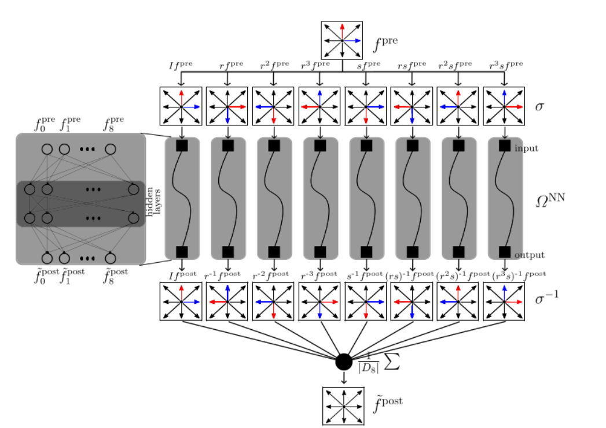
<!-- .element: style="width:100%; border-radius:6px;" -->

</div>
<div>

MSRE <span class="muted">(Corbetta 2023)</span>:

$$ \mathrm{MSRE} = \sum_{i=0}^{8}\left(\frac{f_i^{\text{post}}-\hat{f}_i^{\text{post}}}{f_i^{\text{post}}}\right)^{2} $$


<!-- .element: style="width:100%; border-radius:6px;" -->

</div>
</div>

--

## GAVG vs. plain MLP

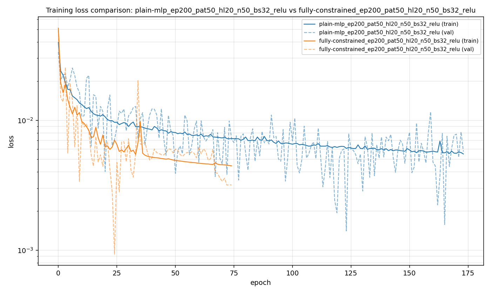
<!-- .element: style="width:100%; border-radius:6px;" -->

---

## Taylor–Green Vortex as a Stability Benchmark

<div class="cols">

<div style="width:54%;">

### Why Taylor–Green?

- Periodic array of decaying vortices
- Analytical solution --> long-time recursive stability test
- Tiny ML errors accumulate over many timesteps

<br>

<div style="text-align:center; margin-top:18px;">

### Analytical decay

$$
u(t) = u_0 e^{-2 \nu k^2 t}
$$

### Initial condition
<div style="font-size:0.9em;">
$$
u_x=u_0\sin(kx)\cos(ky)
$$

$$
u_y=-u_0\cos(kx)\sin(ky)
$$
</div>
</div>

</div>

<div style="width:46%;">

<div style="
display:grid;
grid-template-columns: 1fr 1fr;
gap:2px;
justify-items:center;
align-items:center;
margin-bottom:10px;
">

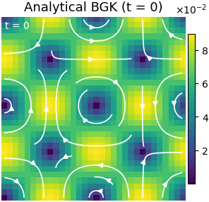
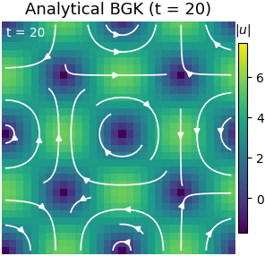
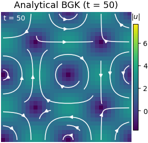
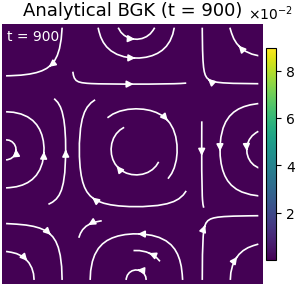

</div>

<p class="cap">
Taylor–Green vortex evolution at increasing timesteps
</p>

</div>

</div>

--

# Taylor–Green analytical solution

### Velocity field

$$
u_x(x,y,t)=u_0\sin(kx)\cos(ky)e^{-2\nu k^2 t}
$$

$$
u_y(x,y,t)=-u_0\cos(kx)\sin(ky)e^{-2\nu k^2 t}
$$

### Pressure field

$$
p(x,y,t)=p_0-\frac{\rho u_0^2}{4}[\cos(2kx)+\cos(2ky)]e^{-4\nu k^2 t}
$$

--

# Velocity field evolution across model variants

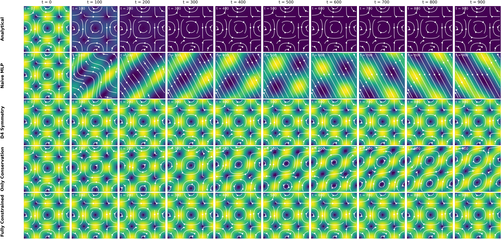

---

## What Happens if We Train a Neural Network?

<div class="r-stack">

<!-- ====================================================== -->
<!-- INITIAL 3-COLUMN STORY -->
<!-- ====================================================== -->

<div class="fragment fade-out" data-fragment-index="5">

<div class="cols">

<!-- ========================================= -->
<!-- NAIVE -->
<!-- ========================================= -->

<div
  class="fragment fade-in"
  data-fragment-index="0"
  style="
    width:30%;
    display:flex;
    flex-direction:column;
    justify-content:space-between;
  "
>

### Naive MLP

- No physical structure enforced
- Errors accumulate during rollout

<br>

<div style="
height:260px;
display:flex;
align-items:flex-end;
justify-content:center;
">

</div>

<p class="cap" style="font-size:0.75em;">
Vortex structure breaks down during long-time evolution
</p>

</div>

<!-- ========================================= -->
<!-- SYMMETRY -->
<!-- ========================================= -->

<div
  class="fragment fade-in"
  data-fragment-index="1"
  style="
    width:30%;
    display:flex;
    flex-direction:column;
    justify-content:space-between;
  "
>

### Lattice Symmetry

- Outputs are averaged over symmetry transforms to respect D4 lattice symmetry

<br>

<div style="
height:260px;
display:flex;
align-items:flex-end;
justify-content:center;
">

</div>

<p class="cap" style="font-size:0.75em;">
Symmetry averaging restores coherent vortex structure
</p>

</div>

<!-- ========================================= -->
<!-- CONSERVATION -->
<!-- ========================================= -->

<div
  class="fragment fade-in"
  data-fragment-index="2"
  style="
    width:30%;
    display:flex;
    flex-direction:column;
    justify-content:flex-start;
  "
>

### Conservation

<div style="
font-size:1.0em;
line-height:1.2;
margin-top:10px;
margin-bottom:10px;
height:150px;
">

<div style="margin-bottom:15px;">
\(\sum_i f_i = \rho\)
</div>

<div>
\(\sum_i f_i c_i = \rho u\)
</div>

</div>

<br>

<!-- ========================================= -->
<!-- DECAY PLOT STACK -->
<!-- ========================================= -->

<div
style="
height:260px;
display:flex;
align-items:flex-end;
justify-content:center;
margin-top:auto;
"
>

<div class="r-stack" style="width:100%;">

<!-- SYMMETRY ONLY -->

<div
class="fragment current-visible"
data-fragment-index="2"
>

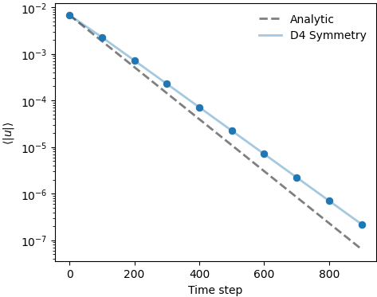

</div>

<!-- CONSERVATION -->

<div
class="fragment current-visible"
data-fragment-index="3"
>


</div>

<!-- FULL ABLATION -->

<div
class="fragment"
data-fragment-index="4"
>

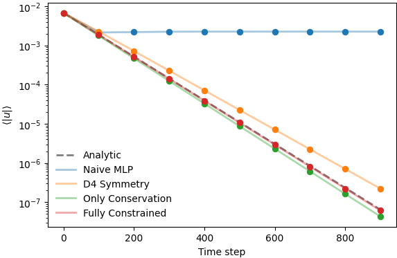

</div>

</div>

</div>

<p
class="cap fragment fade-out"
data-fragment-index="5"
style="font-size:0.75em;"
>
Progressive improvement in long-time velocity decay
</p>

</div>

</div>

</div>

<!-- ====================================================== -->
<!-- FINAL QUALITATIVE COMPARISON -->
<!-- ====================================================== -->

<div
class="fragment fade-in"
data-fragment-index="5"
style="width:100%;"
>

<div class="cols">

<!-- ========================================= -->
<!-- ANALYTIC -->
<!-- ========================================= -->

<div style="width:50%; text-align:center;">

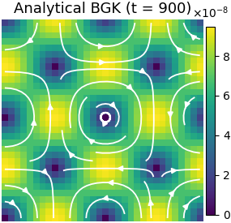

<p class="cap">
Analytical BGK solution
</p>

</div>

<!-- ========================================= -->
<!-- TRAINED -->
<!-- ========================================= -->

<div style="width:50%; text-align:center;">


<p class="cap">
Fully constrained ML-LBM
</p>

</div>

</div>

<div class="box" style="margin-top:20px; text-align:center;">

The constrained model preserves both the analytical velocity decay and coherent vortex structure during long-time recursive simulations.

</div>

</div>

</div>

---

<!-- .slide: class="tc" -->

## However, Kármán vortex street challenges

Flow past a cylinder, **Re 150** — classical BGK-LBM vs learned ML-LBM.

<div class="cols" style="margin-top:10px;">
<div>

<p class="cap" style="text-align:center;">Classical BGK-LBM</p>
</div>
<div>

<p class="cap" style="text-align:center;">ML-LBM (learned collision)</p>
</div>
</div>

<div class="box" style="text-align:center; margin-top:8px;">

Same wake, same shedding frequency was expected —> mass & momentum conserved <span class="highlight">exactly</span> in both.
Yet the symmetry is not broken in the ML scenario. Suppressing the symmetry break? Fail to catch chaotic butterfly effect?

</div>

--

## Evaluation of NN Performance

<div style="display:flex; justify-content:center; align-items:center; height:60vh;">
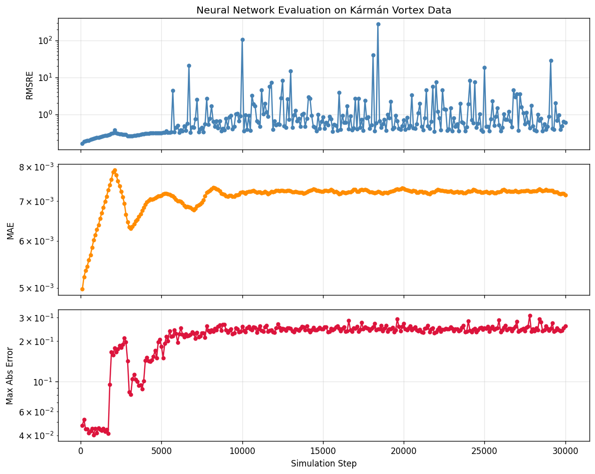
</div>

<div class="box" style="text-align:center; margin-top:8px;">

Model error throughout a simulation compared to classical BGK simulation of Karman Vortex Street

</div>

--

## Extra: How does Karman Vortex Look in Reality?

<div style="display:flex; justify-content:center; align-items:center; height:60vh;">

</div>

---

## Beyond GAVG — ResNet + GAVG

<div class="cols">
<div>

Collision is **already a residual**: $f^{\text{post}} = f^{\text{pre}} + \Delta f$, and $\Delta f \to 0$ near equilibrium.

Same D4 + conservation wrapper; only the inner net becomes residual blocks:

```python
x = Dense(n, "relu")(x)
x = Dense(n, activation=None)(x)  # may be negative
x = Add()([x, residual])          # corrects either way
```

</div>
<div>

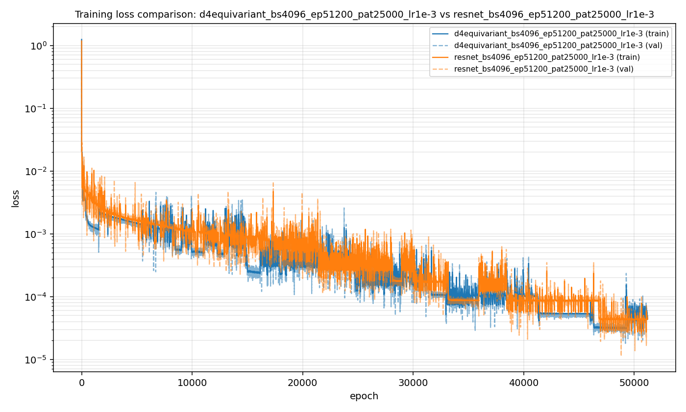
<!-- .element: style="width:100%; border-radius:6px;" -->

</div>
</div>


---

## GAVG + ResNet trained with TG synthesis dataset does not catch the chaotic behavior


---

## We caught the butterfly!


Flow past a cylinder, **Re 150** — classical BGK-LBM vs learned ML-LBM.

<div class="cols" style="margin-top:10px;">
<div>

<p class="cap" style="text-align:center;">Classical BGK-LBM</p>
</div>
<div>

<p class="cap" style="text-align:center;">ML-LBM (learned collision)</p>
</div>
</div>

<div class="box" style="text-align:center; margin-top:8px;">

Learn from complex data helps the model smarter.

</div>

---

## Summary
<div class="cols" style="margin-top:10px;">
<div>

<p class="cap" style="text-align:center;">Numerical BGK-LBM</p>
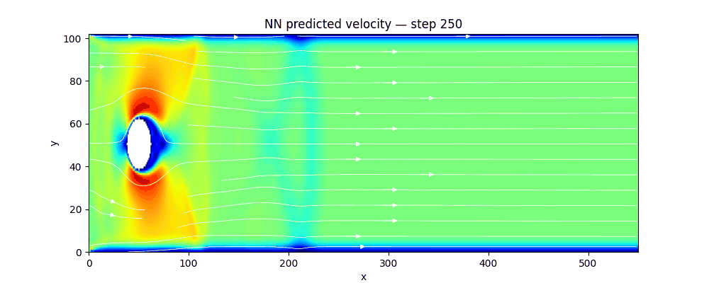
<p class="cap" style="text-align:center;">ML-LBM (GAVG, KVS dataset trained)</p>
</div>
<div>

<p class="cap" style="text-align:center;">ML-LBM (GAVG + ResNet, KVS dataset trained)</p>

<p class="cap" style="text-align:center;">ML-LBM (GAVG, TG dataset) (GAVG + ResNet, TG dataset is similar)</p>
</div>
</div>

---

## Future work

- **LENNs — Lattice Equivariant NNs.** Symmetry as a reusable building block, not a hand-wired lift/average around one MLP.
- **Push to 3D.** Same group-equivariance recipe on D3Q27.
- **Real-world flows.** Hemodynamics, supernova hydrodynamics, aerodynamics; domain boundaries via surrogate models.
- **Measure of Supression**. How much is the ML model supressing the anti-symmetry? Affects generalization.
- **Sensitivity to initial conditions**. Are the ML model results easily reproducible and general?
- **Boundary condition handling**
- **Training for chaotic systems**
- **Model generalization**

---

## Future work — more operators

Beyond single-relaxation BGK: MRT, multiphase, thermal — across varying $\tau$ and resolution.

| Operators | Surrogate model | Taylor–Green | Lid-Driven | Kármán Vortex Street |
| :--- | :--- | :---: | :---: | :---: |
| **BGK** | GAVG | ✓ | N/A | ✓ |
| | ResNet | ✓ | N/A | ✓ |
| | LENN | N/A | N/A | N/A |
| **MRT** | NCO | N/A | N/A | N/A |

<p class="cap">✓ = validated · N/A = not yet attempted.</p>

--

## LENN


<!-- .element: style="width:100%; border-radius:6px;" -->

--

## NCO


<!-- .element: style="width:100%; border-radius:6px;" -->

---

## How this project was cooked

<div class="cols">
<div>

| Metric | Count |
|---|---|
| Claude Code messages | *NN* |
| Tool calls (edits + runs) | *NN* |
| Files touched | *NN* |
| Training samples | 100&thinsp;000 |
| Snellius Budeget | 15000+ GPU hours |
| Code | git fame |

<p class="cap">Placeholder counts — fill in from workspace logs.</p>

</div>

<div class="box">

We appreciate the opportunity to propose our project.

</div>

<div>


<!-- .element: style="width:100%; border-radius:6px;" -->

<div class="box">

Most effort went into **deriving the constraints** (D4, conservation) — getting the structure right kept the network small and training short.

</div>

</div>
</div>


--

## Snellius GPU hours top 5


<!-- .element: style="width:100%; border-radius:6px;" -->

---

## Takeaways
- It is possible to learn collision operators of LBM. Supposedly all operators are possible.
- By applying physics-informed constraints such as GAVG, the model is more accurate than MLP with the same layer number.
- Train the model with dataset with complex physics embedded makes the model "smarter".
- ResNet can help catch the nuance of chaotic system.

---

## Appendix — Corbetta, Gabbana et al. (2023)

*Toward learning Lattice Boltzmann collision operators.* EPJ-E **46**, 10 (2023).

- introduces the learned-collision framing and the RMS-relative-error loss we adopt
- D2Q9 lattice, BGK baseline, symmetry-aware networks

<a href="https://arxiv.org/abs/2212.06124" target="_blank">arxiv:2212.06124</a>

---

## Appendix — how we used GenAI

<div class="cols">
<div>

<div class="box">

<span class="muted" style="color:#3498db; font-weight:600;">1 · Draft manually</span>

We own the **architecture and spec** — D4 symmetry, conservation algebra, train/sim split. AI fills in against *our* design.

</div>

<div class="box">

<span class="muted" style="color:#3498db; font-weight:600;">2 · Gate & verify</span>

Every line **read and checked**: conservation to machine precision, limits right, results match baseline.

</div>

</div>
<div>

<div class="box">

<span class="muted" style="color:#3498db; font-weight:600;">3 · Always reproducible</span>

Output accepted only as **scripts** — fixed seeds, pinned configs, one command per figure.

</div>

<div class="box" style="background:#eef5fb; border:1px solid #d6e6f5;">

**Principle:** GenAI is a fast junior collaborator — <span class="highlight">accountable to us</span>. We own design, verification, reproducibility.

</div>

</div>
</div>

---

## Appendix — training and computing time and tips

training --> batch size, OOO error
LBM --> GPU

